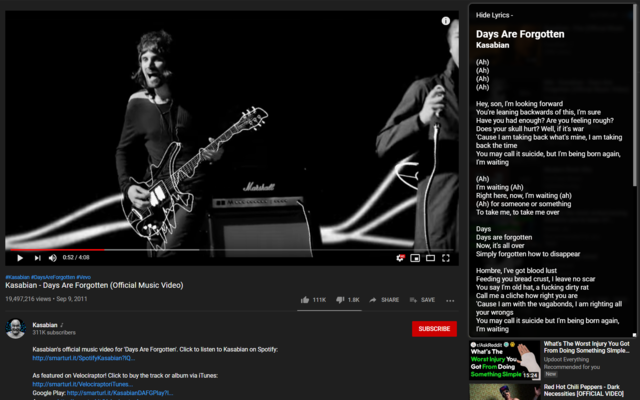
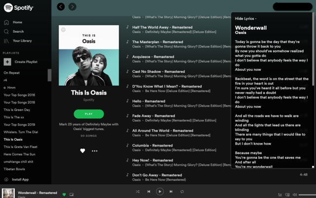

LyriKa
===
Lyrics for Youtube, YT Music, Google Play Music and Spotify Web

Installation
---

    <a href="https://addons.mozilla.org/en-US/firefox/addon/lyrics-for-music" target="_blank">
         Mozilla Firefox
    </a> 
    |
    <a href="https://microsoftedge.microsoft.com/addons/detail/injjdcoofnbiejngdkfnpoeelkmjokmm?hl=en-US" target="_blank">
         Microsoft Edge
    </a> 
    |
    <a href="https://chrome.google.com/webstore/detail/lyrika/fploppldpenfnknabfnifniandmadibh" target="_blank">
         Google Chrome
    </a>  

About
---

Lyrics for your favorite songs on your favorite sites! Now supports Spotify (Web), Youtube, YT Music and Google Play Music. LyriKa pulls lyrics for songs you play on Youtube or Spotify and displays them right there.

